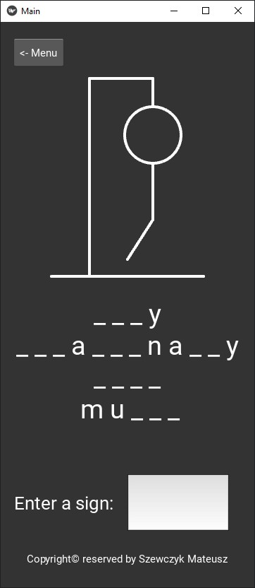
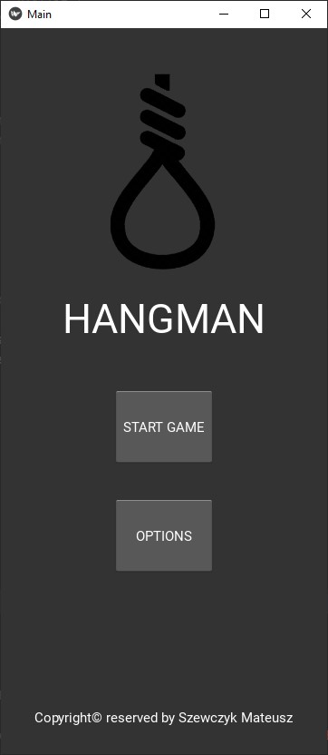
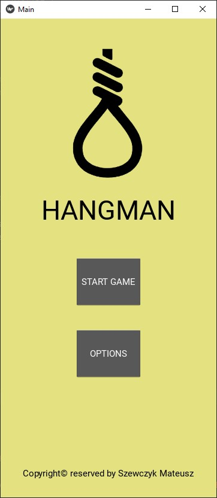

# Mobile app
<b>HANGMAN -></b> The application was created to pass the course "Programowanie urządzeń mobilnych - Projekt"

# UI preview:


# Features:
- Sentence to find is randomly generated after each "Start game" click.
```python
    # sentences
    subjects = ["I", "You", "He", "She", "They", "We"]
    adverbs = ["now", "today", "always", "never", "occasionally", "probably"]
    verbs = ["love", "hate", "like", "enjoy", "dislike"]
    objects = ["apples", "bananas", "cats", "dogs", "music", "movies"]
    
    
    def generate_random_sentence():
        subject = random.choice(subjects)
        adverb = random.choice(adverbs)
        verb = random.choice(verbs)
        obj = random.choice(objects)
        return f"{subject} {adverb} {verb} {obj}"
  ```
- User can set dark and light mode in options

  | Dark mode | Light mode |
  | ----------| ---------- |
  |  |  |

- Error handling for double press the same letter, enter empty string, enter denied chars, enter more than 1 char
- Hangman image is automatically updating
- After lose user see "Lose Popup"
- After lose user see "Win Popup"

### Copyright© reserved by Szewczyk Mateusz
